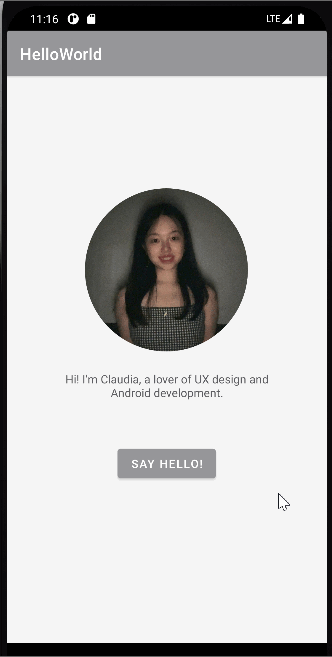

# Android Prework - *Hello World*

Submitted by: **Claudia Wei**

**Hello World** is an android app that shows an image and introductory message, and allows pressing a button to display a Toast. 

Time spent: **0.8** hours spent in total

## Required Features

The following **required** functionality is completed:

* [x] Image and introductory message displayed on screen
* [x] Button displayed on screen
* [x] Toast with message appears when button is pressed 

The following **optional** features are implemented:

* [x] List anything else that you can get done to improve the app functionality!

## Video Walkthrough

Here's a walkthrough of implemented features:

GIF created with [LiceCap](http://www.cockos.com/licecap/).

## Notes

Here are some challenges I met when I was building the MyIntro app:
* I spent some time figuring out how to customize my app such as background color, image shape and etc.
* It took me amlong time to understand how to use git to submit my homework. For example: I met a problem "git pull failed" which made me feel really confused and struggled because in the video there wasn't any problem like that. Luckily, I found out the answer in stackoverflow and fixed it successfully. And now I'm feeling like it would be much better if we can find answers by ourselves rather than simply follwing tutorials. The ability of self-leaning is also important during the learning process.  

## License

    Copyright [Claudia Wei] 

    Licensed under the Apache License, Version 2.0 (the "License");
    you may not use this file except in compliance with the License.
    You may obtain a copy of the License at

        http://www.apache.org/licenses/LICENSE-2.0

    Unless required by applicable law or agreed to in writing, software
    distributed under the License is distributed on an "AS IS" BASIS,
    WITHOUT WARRANTIES OR CONDITIONS OF ANY KIND, either express or implied.
    See the License for the specific language governing permissions and
    limitations under the License.
